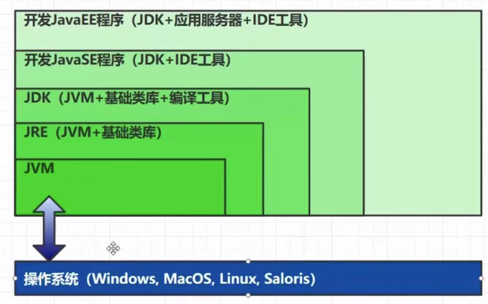
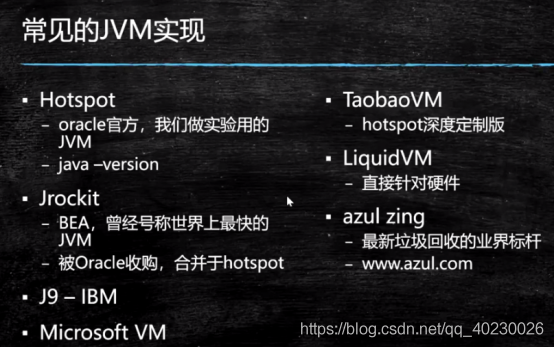
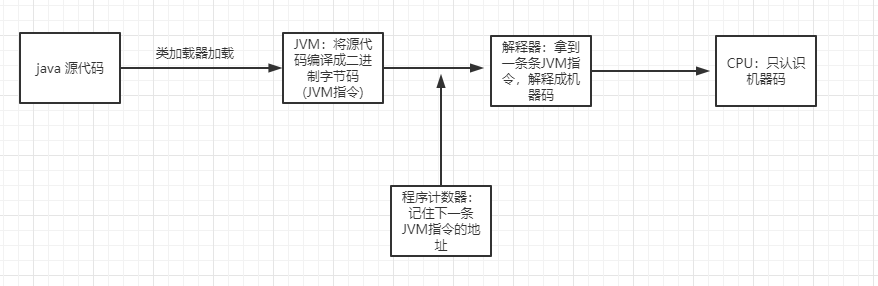
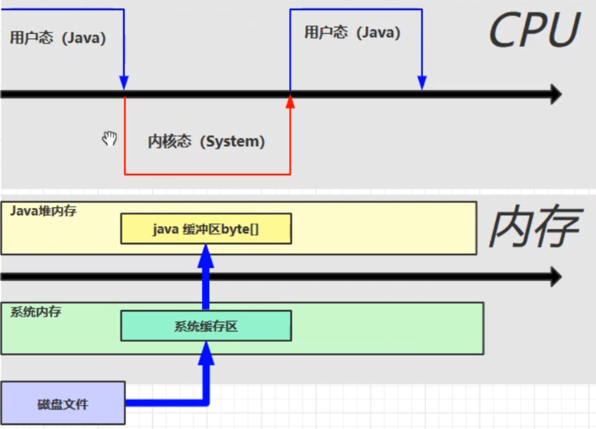

* [目录](#目录)
  * [1：JVM基础知识](#1jvm基础知识)
    * [1.1：什么是JVM？](#11什么是jvm)
    * [1.2：好处](#12好处)
    * [1.3：JVM和JDK,JRE的关系(面试)](#13jvm和jdkjre的关系面试)
    * [1.4：常见的JVM](#14常见的jvm)
    * [1.5: JVM的学习步骤](#15-jvm的学习步骤)
  * [2：JVM 内存模型](#2jvm-内存模型)
    * [2：程序计数器：Program Counter Register](#2程序计数器program-counter-register)
    * [2.2：虚拟机栈：线程运行需要的内存空间，线程私有 参数-Xss控制,在1MB左右](#22虚拟机栈线程运行需要的内存空间线程私有-参数-xss控制在1mb左右)
    * [2.3:本地方法桟:给本地方法提供的内存空间,线程私有的](#23本地方法桟给本地方法提供的内存空间线程私有的)
    * [2.4:堆 heap:线程共享, -Xmx 参数控制堆空间最大值](#24堆-heap线程共享--xmx-参数控制堆空间最大值)
    * [2.5:方法区 Method Area 线程共享 -XX:MaxMetaspaceSize控制,默认无上限](#25方法区-method-area-线程共享--xxmaxmetaspacesize控制默认无上限)
    * [2.6:直接内存](#26直接内存)
    * [2.7:字节码常用指令](#27字节码常用指令)
    * [2.8:相关JVM参数](#28相关jvm参数)
  * [3：垃圾回收GC](#3垃圾回收gc)
    * [3.1：如何判断对象可以回收](#31如何判断对象可以回收)
      * [3.1.1:什么是垃圾](#311什么是垃圾)
      * [3.1.2:如何定位垃圾](#312如何定位垃圾)
      * [3.1.3:强软弱虚 四种引用](#313强软弱虚-四种引用)
    * [3.2：垃圾回收算法](#32垃圾回收算法)
    * [3.3:分代垃圾回收](#33分代垃圾回收)
    * [3.4：垃圾回收器](#34垃圾回收器)
    * [3.：垃圾回收调优](#3垃圾回收调优)
  
## 1：JVM基础知识

### 1.1：什么是JVM？

JVM是一种规范,人们常说Java是跨平台的语言,而JVM帮助屏蔽了不同操作系统的底层，是跨语言的平台． 它不仅仅应用于Java语言，它是可以认识所有能编译成.class格式的文件（二进制字节码文件）．

### 1.2：好处

* 一次编写，到处运行的基石：java通过JVM 跨平台，JVM 屏蔽了字节码与底层操作系统之间的差异，对外提供了一个一致的运行环境。JVM解释执行字节码
* 自动内存的管理机制，垃圾回收功能：虽然现在很多语言都有这个功能，但java出现较早，竞争对手是C，C++，无需手动释放内存
* 数组下标越界的检查：抛出异常，C语言没有数组下标越界检查，一旦数组越界，可能覆盖其他代码的内存。
* 多态：面向对象编程的基石：java使用虚方法表的方式来实现多态

### 1.3：JVM和JDK,JRE的关系(面试)



### 1.4：常见的JVM



其中，我们目前安装JDk使用的是HotSpot,这个是oracle官方那个是用的,有很多实力公司不依赖oracle公司的这个,他们会根据JVM规范自己实现一些虚拟机, 比如淘宝的是TaobaoVM(
免费,Java虚拟机收费大家可以可以使用这个),还有商业版本收费，垃圾回收最快的azul zing(有钱公司使用). 所以说:一流的公司制造规范,二流的公司实现规范,三流的公司使用规范.

### 1.5: JVM的学习步骤

1: 类加载器 2：JVM内存模型 3：执行引擎：解释器，即时编译器（JIT编译热点代码），GC垃圾回收  
4：操作系统：本地方法接口

## 2：JVM 内存模型

### 2：程序计数器：Program Counter Register



* 作用：通过寄存器来实现，记录下一条JVM指令的执行地址。方便线程上下文切换,记录线程执行到那条指令
* 特点：线程私有的。JVM中，唯一一个不会出现内存溢出的区。

### 2.2：虚拟机栈：线程运行需要的内存空间，线程私有 参数-Xss控制,在1MB左右

栈：先进后出 可以通过参数-Xss控制，windows系统受虚拟内存影响，其他系统默认1MB。 一个栈由多个栈帧组成。一个战帧对应一次方法的调用，栈帧是方法运行时需要的内存。 注意：每个线程只能有一个活动栈帧，对应着正在执行的那个方法。
栈帧(主要四个部分组成)：

* Local Variable Table:本地变量(局部变量)表,方法内部使用的,参数也算在内，以变量槽为最小单位，每个槽32位的内存空间。
  局部变量表主要用于存储方法参数和定义在方法体内的局部变量，这些数据类型包括各类原始数据类型、对象引用(reference)，
  以及returnAddress类型。局部变量表所需的容量大小在编译期就可以被完全确定下来，并保存在方法的Code属性中。
* Operand Stack:操作数栈(表达式栈)
  对于long的处理（store and load），多数虚拟机的实现都是原子的 局部变量，没必要加volatile，线程私有的。
  操作数栈所需的容量大小在编译期就可以被完全确定下来，并保存在方法的Code属性中。通过标准的出入栈完成数据访问 32位数据类型所占的栈容量为1，64位数据类型所占的栈容量为2。
* Dynamic Linking:动态链接,指向常量池的符号链接,如果没有解析,就去动态解析
  https://blog.csdn.net/qq_41813060/article/details/88379473
  jvms 2.6.3
* return address:返回值地址 a() -> b()，方法a调用了方法b, b方法的返回值放在什么地方

问题： --垃圾回收是否涉及栈内存？ 不需要，方法执行完会弹栈 --栈内存分配越大越好吗？ 栈越大，会导致线程数变少;大了可以更多次方法的调用 --方法内的局部变量是否线程安全？
如果方法内局部变量没有逃离方法的作用范围，那么就是线程安全；如果变量引用了对象，并逃离范围，需要考虑安全问题。

栈内存溢出： Java.lang.StackOverflowError

* 栈帧过多，比如多次的递归调用，这个比较常见;比如两个类循环依赖,json解析时可能也会出现
* 栈帧过大，这个很少发生。

线程运行诊断:
案例1:CPU占用过多 linux中 top命令 可以查看进程pid ps H -eo pid,tid,%cpu | grep pid :会把linux中那个进程的线程的进程号(10进制)和CPU显示出来 jstack pid :
显示这个进程下所有进程的运行情况,根据上面的10进制线程号换算到16进制,找到对应线程nid,查看出现问题的代码行数 案例2:程序运行很长时间没有结果：有可能是线程死锁导致   
jstack pid：显示运行信息，观察最下面的 java-level deadlock

### 2.3:本地方法桟:给本地方法提供的内存空间,线程私有的

本地方法 native method:C或C++编写的与操作系统交互的方法.

### 2.4:堆 heap:线程共享, -Xmx 参数控制堆空间最大值

通过new关键字创建对象都会使用堆内存.

特点:
--线程共享,堆中对象都需要考虑线程安全问题 --有垃圾回收机制

堆内存溢出:java.lang.OutOfMemoryError: Java heap space

堆内存诊断:
--jps工具:查看当前系统中有哪些java程序 命令行 jps ,找到进程 id --jmap工具:查看某个时刻堆内存占用情况 命令行 jmap -heap pid --jconsole工具:图形界面的,多功能的监测工具,可以连续监测
命令行 jconsole ,选择连接进程 --jvisualvm 工具:可视化工具 命令行 jvisualvm,选择连接的项目,堆 dump,

**案例:
垃圾回收后,内存占用依然很高. 大对象,不停的添加对象

### 2.5:方法区 Method Area 线程共享 -XX:MaxMetaspaceSize控制,默认无上限

存储类相关信息 和运行时常量池,串池(1.8之前),逻辑上方法区是堆的组成部分,但实际上根据实现公司的不同可能会不一样 jdk 1.8 之前,方法区叫做永久代(PermGen space),使用的就是堆的一部分.
字符串常量位于PermSpace,FGC不会清理 jdk 1.8之后,移除了永久代,使用了元空间(Metaspace),不再是堆空间的一部分,使用的本地内存,默认不设置上限,  
字符串常量位于堆,会触发FGC清理 不设定的话，最大就是物理内存


方法区内存溢出:
1.8之后: java.lang.OutOfMemoryError: Metaspace 1.8之前: java.lang.OutOfMemoryError: PermGen space

** 案例 spring或者mybatis使用cglib动态代理,动态生成类的字节码,动态的类加载.在运行期间会加载大量的类,在1.8之前很可能会溢出;1.8之后容错率增大.

运行时常量池 二进制字节码(类基本信息,常量池,类方法定义(包含了虚拟机指令))
class文件常量池:存放常量的符号引用,一个class文件一个常量池.就是一张表, 虚拟机指令根据这张常量表找到要执行的类名、方法名、参数类型、字面量信息 运行时常量池:
常量池是.class文件中的，当类加载到内存中后，jvm就会将class常量池中的内容存放到运行时常量池中, 并把里面的符号地址变为真实地址.每个类都会有一个运行时常量池 注意:
类加载进JVM方法区,有常量池,是静态的,不会改变;运行时常量池具有动态性,可在JVM运行期间动态向运行时常量池中写入数据。

StringTable:存的是引用值而不是具体的实例对象 串池,数据结构是HashTable,一开始是固定的,并且是不能是扩容的. 1.8之前位于永久代,full
GC才会触发垃圾回收,导致StringTable的回收效率并不高,内存不足就是永久代内存不足 java.lang.OutOfMemoryError: PermGen space 1.8之后在堆中,Minor
GC就可以触发垃圾回收,内存不足就是堆内存不足 (符号表也在堆中)
java.lang.OutOfMemoryError: GC overhead limit exceeded ,需要把此参数关闭 -XX:-UseGCOverheadLimit, 会显示
java.lang.OutOfMemoryError: Java heap space ldc,将一个符号引用变成字符串对象后,会到 StringTable里面查找,如果没有,就把刚才的字符串对象放入串池,否则就增加一个引用.

例子1:

```java
        // 懒惰的.用到了才会到StringTable里面创建,用不到不会提前创建的 ,s1,s2,s3放在串池中
        String s1="a";
                String s2="b";
                String s3="ab";
                // new StringBuilder().append("a").append("b").toString()  new String("ab")  放在堆中,两个变量拼接
                String s4=s1+s2;
                // javac 在编译期间的优化，结果已经在编译期确定为ab,两个常量拼接,先去串池中寻找,没有的话就添加到串池中.
                String s5="a"+"b";
```

例子2:

```java
        String x="ab";

        // 堆  new String("a")   new String("b")    new String("ab"),仅存在堆中,动态拼接的,s是变量
        String s=new String("a")+new String("b");

        // 将s字符串对象尝试放入串池，如果有则并不会放入，如果没有则放入串池，会把串池中的对象返回
        String s2=s.intern();

        System.out.println(s2==x);
        System.out.println(s==x);
```

常量池中的字符串仅是符号，只有在被用到时才会转化为对象 利用串池的机制，来避免重复创建字符串对象 字符串变量拼接的原理是StringBuilder,放在堆中 字符串常量拼接的原理是编译器优化,放在串池中
可以使用intern方法，主动将串池中还没有的字符串对象放入串池中 1.8之后,将这个字符串对象尝试放入串池,如果有则不会放入,没有则把对象放入串池,会把串池中的对象返回
1.8之前,,将这个字符串对象尝试放入串池,如果有则不会放入,没有则把此对象复制一份放入串池,(不相等,是一个副本),会把串池中的对象返回 注意：无论是串池还是堆里面的字符串，都是对象

垃圾回收:
HashTable 默认大小 60013,内存紧张时，会发生垃圾回收

性能调优:
** 增加StringTable的桶的个数，来减少字符串放入串池所需要的时间: -XX:StringTableSize=xxxx
** 考虑将字符串对象是否入池 ：如果有大量的字符串，且重复率很高，可以采用 s.intern() 入池，减少堆内存的使用，平常写代码可使用。

### 2.6:直接内存

常用于NIO操作时，用于数据缓冲区。 分配回收成本较高，单读写性能高。 不受JVM内存回收管理。 直接内存是操作系统和Java代码都可以访问的一块区域，无需将代码从系统内存复制到Java堆内存，从而提高了效率 Direct Memory:
直接内存:用户空间可以访问os内存
> JVM可以直接访问的内核空间的内存 (OS 管理的内存)
> NIO ， 提高效率，实现zero copy,以前需要将网络传到内存中的东西拷贝到JVM内存,现在省去拷贝时间,直接去访问

1.7之前java的读写流程


1.8之后使用直接内存的读写流程


内存溢出:直接内存也是可能会溢出的

释放原理:
--使用了Unsafe类的allocateMemory方法来完成直接内存的分配回收，回收需要主动调用freeMemory方法,并非是由GC回收的
--ByteBuffer的实现类内部使用了Cleaner（虚引用）来检测ByteBuffer对象。一旦ByteBuffer被垃圾回收， 那么会由ReferenceHandler线程(守护线程)
来调用Cleaner的clean方法调用freeMemory来释放内存 -- 注意:-XX:+DisableExplicitGC 禁用显示的垃圾回收,让代码中的 System.gc()回收不起作用,则直接内存不会释放,必须等到真正GC的时候
才会释放,在代码中,也不推荐使用 System.gc(),是Full GC,程序暂停时间比较长,最好管理直接内存的方式就是手动 Unsafe类释放.

源码分析:

```java
        //这里通过 ByteBuffer分配了 1GB 的直接诶内存
        ByteBuffer byteBuffer=ByteBuffer.allocateDirect(_1Gb);
                System.out.println("分配完毕...");
                System.in.read();
                System.out.println("开始释放...");
                //将 byteBuffer 引用置为null
                byteBuffer=null;
                System.in.read();
```

```java
/**
 分配一个新的直接字节缓冲区。
 新缓冲区的位置将为零，其极限将是其容量，其标记将是未定义的，并且其每个元素都将初始化为零。 不确定是否具有backing array 。
 参数：容量–新缓冲区的容量，以字节为单位
 返回值：新的字节缓冲区
 抛出：IllegalArgumentException如果容量为负整数
 */
public static ByteBuffer allocateDirect(int capacity){
        return new DirectByteBuffer(capacity);
        }
```

```java
/**
 * 构造器 
 * unsafe.allocateMemory(size);
 * unsafe.setMemory(base, size, (byte) 0);
 * 通过上面分配直接内存
 */
    DirectByteBuffer(int cap){                   // package-private

            super(-1,0,cap,cap);
            boolean pa=VM.isDirectMemoryPageAligned();
            int ps=Bits.pageSize();
            long size=Math.max(1L,(long)cap+(pa?ps:0));
            Bits.reserveMemory(size,cap);

            long base=0;
            try{
            // 通过unsafe.allocateMemory() 分配内存
            base=unsafe.allocateMemory(size);
            }catch(OutOfMemoryError x){
            Bits.unreserveMemory(size,cap);
            throw x;
            }
            unsafe.setMemory(base,size,(byte)0);
            if(pa&&(base%ps!=0)){
            // Round up to page boundary
            address=base+ps-(base&(ps-1));
            }else{
            address=base;
            }
            //Cleaner是虚引用类型，来实现直接内存的释放，this为虚引用的实际对象,如果 this为null,就会触发虚引用的clean方法
            //这里的回调方法是 new Deallocator(base, size, cap)    
            cleaner=Cleaner.create(this,new Deallocator(base,size,cap));
            att=null;

            }
```

```java
//Cleaner是虚引用类型的 clean()方法,调用回调方法的 run()方法
public void clean(){
        if(remove(this)){
        try{
        this.thunk.run();
        }catch(final Throwable var2){
        AccessController.doPrivileged(new PrivilegedAction<Void>(){
public Void run(){
        if(System.err!=null){
        (new Error("Cleaner terminated abnormally",var2)).printStackTrace();
        }

        System.exit(1);
        return null;
        }
        });
        }

        }
        }
```

```java
//回调任务的 run()方法
public void run(){
        if(address==0){
        // Paranoia
        return;
        }
        unsafe.freeMemory(address);
        address=0;
        Bits.unreserveMemory(size,capacity);
        }
```

### 2.7:字节码常用指令

注意:如果方法是非static,局部变量表的0号位都是this,如果是静态方法,那么0号位一般都是参数 bipush 压栈 istore_1:将栈顶的值pop出来,放到局部变量表的1号位置 iload_1:将局部变量表1号位的值拿出来压栈
iinc 1 by 1:把局部变量表1号位置值加1 iadd 在栈里拿出两条int值相加,结果放在栈顶 dup:复制一份,一般执行构造方法的时候会消耗一个5 invokespecial:
执行特殊的方法,一般是init,构造方法,private 方法---可以直接定位，不需要多态的方法 invokevirtual:调用方法,执行另一个栈帧,另一个栈帧执行结束,有返回值,会在栈顶放入这个值 invokeStatic:
调用静态方法 invokeInterface:new对象时上转型,通过接口去调用方法 InvokeDynamic:JVM最难的指令,1.7之后java支持动态语言后加入lambda表达式或者反射或者其他动态语言scala
kotlin，或者CGLib ASM，动态产生的class，会用到的指令 iconst_1 :把1这个立即数压栈 imul:相乘 clinit:类在初始化阶段调用的方法,将static变量赋定义值 init::类构造方法 sub:减法
getstatic :获取一个静态变量 ldc:加载一个引用地址,将一个符号引用变成字符串对象 astore_1 把new出来的引用放进1号串池中 aload_1 从1号串池中取出,放在栈顶 checkcast 用来检验向下转型
ACC_SUPER   :支持父类调用

### 2.8:相关JVM参数

虚拟机栈 可以通过参数-Xss控制，windows系统受虚拟内存影响，其他系统默认1MB。 heap:线程共享, -Xmx 参数控制堆空间最大值 -XX:MaxMetaspaceSize=8m 设置元空间大小默认使用直接内存,没有上限
-XX:StringTableSize=xxxx 设置StringTable的桶的个数 -XX:+DisableExplicitGC 禁用显示的垃圾回收,让代码中的 System.gc()回收

## 3：垃圾回收GC

### 3.1：如何判断对象可以回收

#### 3.1.1:什么是垃圾

> C语言申请内存：malloc free
> C++： new  delete
> c/C++ 手动回收,开发效率低,执行效率高.内存容易出两种类型的问题：
> 1. 忘记回收:内存泄露
> 2. 多次回收:非法访问
>
> Java: new ？
> GC自动内存回收，编程上简单，系统不容易出错.开发效率高,执行效率低

没有任何引用指向的一个对象或者多个对象（循环引用）称为垃圾

#### 3.1.2:如何定位垃圾

1. 引用计数（ReferenceCount） 为0时进行回收 缺点：不能解决循环引用的问题（ABC互相引用，但这个整体却没有引用指向，合起来一堆垃圾，却无法回收）
2. 根可达算法(RootSearching)
   扫描堆中的对象，看能否沿着GC Root对象为起点的引用链找到该对象，如果找不到，则表示可以回收

注意:什么是根对象(GC roots)(重点)？ JVM stack(桟帧中的局部变量表中引用的对象,方法中的变量)
Runtime constant pool(方法区中运行时常量池的一些对象)
Static references in method area (方法区内的静态引用对象和常量对象)
Clazz:系统类对象,.由启动类加载器加载的,不会被回收掉,object,String,Hashmap类等 
Native Method stack(调用 native方法的对象)
monitor:锁住的一些对象
```java
public class Demo2_8 {

    //1:静态对象和常量对象会被加载到方法区中,作为根对象
    static int i = 0;
    final int k = 2;

    public static void main(String[] args) {
        //2:方法中的常量会被放在桟帧中的局部变量中,作为根对象
        final int j = 1;
    }

    //3:调用native方法的对象
    //4:启动类加载器加载的系统类,如String,Object,Hashmap等类对象
    //5:运行时常量池中一些对象
    //6:synchroniced锁住的一些对象
}
```

#### 3.1.3:强软弱虚 四种引用


### 3.2：垃圾回收算法

### 3.3:分代垃圾回收

### 3.4：垃圾回收器

### 3.：垃圾回收调优
